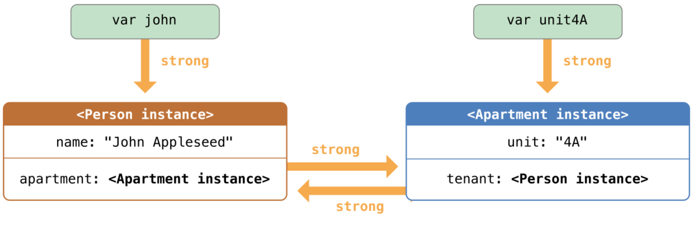
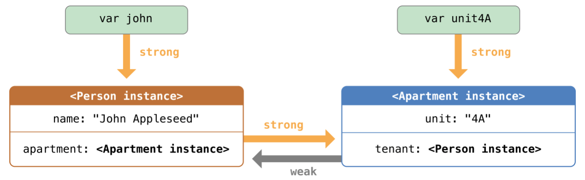
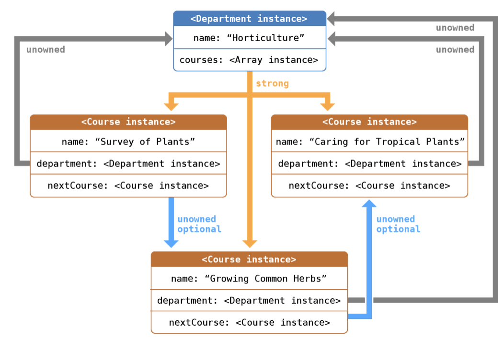

# ARC (Автоматический подсчет ссылок)

## 1. Общие сведения

- Swift использует automatic reference counting (автоматический подсчет ссылок) для отслеживания и управления памятью вашего приложения.
- ARC автоматически освобождает память, которая использовалась экземплярами класса, когда эти экземпляры больше нам не нужны.
- ARC применима только для экземпляров класса. Структуры и перечисления являются типами значений, а не ссылочными типами, и они не хранятся и не передают свои значения по ссылке.

## 2. Работа ARC

- Каждый раз, когда вы создаете экземпляр класса, ARC выделяет фрагмент памяти для хранения информации этого экземпляра. Этот фрагмент памяти содержит информацию о типе экземпляра, о его значении и любых свойствах хранения, связанных с ним.
- Дополнительно, когда экземпляр больше не нужен, ARC освобождает память, использованную под этот экземпляр, и направляет эту память туда, где она нужна. Это своего рода гарантия того, что ненужные экземпляры не будут занимать память.
- Однако, если ARC освободит память используемого экземпляра, то доступ к свойствам или методам этого экземпляра будет невозможен. Если вы попробуете получить доступ к этому экземпляру, то ваше приложение скорее всего выдаст ошибку и будет остановлено.
- Для того, чтобы нужный экземпляр не пропал, ARC ведет учет количества свойств, констант, переменных, которые ссылаются на каждый экземпляр класса. ARC не освободит экземпляр, если есть хотя бы одна активная ссылка.
- Для того чтобы это было возможно, каждый раз как вы присваиваете экземпляр свойству, константе или переменной создается **strong reference** (сильная ссылка) с этим экземпляром. Такая связь называется “сильной”, так как она крепко держится за этот экземпляр и не позволяет ему освободится до тех пор, пока остаются сильные связи.

## 3. ARC в действии

- ARC не освободит экземпляр класса Person в примере до тех пор, пока остается последняя сильная ссылка, уничтожив которую мы укажем на то, что наш экземпляр больше не используется, после этого вызовится деинициализатор и освободится память

```Swift
class Person {
    let name: String
    init(name: String) {
        self.name = name
        print("\(name) инициализируется")
    }
    deinit {
        print("\(name) деинициализируется")
    }
}

var reference1: Person?
var reference2: Person?
var reference3: Person?

reference1 = Person(name: "John Appleseed")
// Выведет "John Appleseed инициализируется"

reference2 = reference1
reference3 = reference1

reference1 = nil
reference2 = nil

reference3 = nil
// Выведет "John Appleseed деинициализируется"
```

## 4. Циклы сильных ссылок между экземплярами классов

- **Цикл сильных ссылок** - это когда экземпляры классов имеют сильные связи друг с другом, что не позволяет им освободиться.

```Swift
class Person {
    let name: String
    init(name: String) { self.name = name }
    var apartment: Apartment?
    deinit { print("\(name) освобождается") }
}
 
class Apartment {
    let unit: String
    init(unit: String) { self.unit = unit }
    var tenant: Person?
    deinit { print("Апартаменты \(unit) освобождаются") }
}

var john: Person?
var unit4A: Apartment?

// картинка 1
john = Person(name: "John Appleseed")
unit4A = Apartment(unit: "4A")

// картинка 2
john!.apartment = unit4A
unit4A!.tenant = john

// картинка 3
// Сильные взаимные ссылки остались между экземплярами Person и Apartment и не могут быть разрушены.
john = nil
unit4A = nil

```

#### Картинка 1  


#### Картинка 2  


#### Картинка 3  


## 5. Замена циклов сильных ссылок между экземплярами классов

- Вы сами решаете, когда сделать вместо сильной (**strong**) ссылки слабую (**weak**) или бесхозную (**unowned**).
- Слабые и бесхозные ссылки позволяют одному экземпляру в цикле ссылок ссылаться на другой экземпляр без сильного прикрепления. Экземпляры могут ссылаться друг на друга без создания цикла сильных связей.
- **Используйте слабую ссылку**, если другой экземпляр имеет более короткое время жизни, то есть когда другой экземпляр может быть освобожден первым.
- **Используйте бесхозные ссылки**, если другой экземпляр имеет одинаковое время жизни или более длительный срок службы.

## 6. Слабые (weak) ссылки

- Слабые ссылки не удерживаются за экземпляр, на который они указывают, так что ARC не берет их во внимание, когда считает ссылки экземпляра.
- Так как слабая ссылка не сильно держит экземпляр, то этот экземпляр может быть освобожден, пока слабая ссылка все еще ссылается на него. Таким образом ARC автоматически присваивает слабой ссылке nil, когда экземпляр, на который она указывает, освобождается. 
- И поскольку слабые ссылки должны позволять изменять их значение до nil во время выполнения, они всегда объявляются как переменные, а не как константы опционального типа.
- Когда ARC устанавливает слабую ссылку на nil, наблюдатели свойств не вызываются.

```Swift
class Person {
    let name: String
    init(name: String) { self.name = name }
    var apartment: Apartment?
    deinit { print("\(name) деинициализируется") }
}
 
class Apartment {
    let unit: String
    init(unit: String) { self.unit = unit }
    weak var tenant: Person?
    deinit { print("Apartment \(unit) деинициализируется") }
}

var john: Person?
var unit4A: Apartment?
 
john = Person(name: "John Appleseed")
unit4A = Apartment(unit: "4A")

// Картинка 4
john!.apartment = unit4A
unit4A!.tenant = john

// Картинка 5
john = nil
// Выведет "John Appleseed деинициализируется"

// Картинка 6
unit4A = nil
// выводит "Апартаменты 4A деинициализируется"
```

#### Картинка 4  


#### Картинка 5  


#### Картинка 6  


## 7. Бесхозные (unowned) ссылки

- Как и слабые ссылки, бесхозные ссылки также не имеют сильной связи с экземпляром, на который они указывают. 
- В отличии от слабых ссылок, бесхозные ссылки всегда имеют значение. Из-за этого бесхозные ссылки имеют неопциональный тип. 
- Вы указываете на то, что ссылка бесхозная ключевым словом **unowned**, поставленным перед объявлением свойства или переменной.
- ARC не может установить значение ссылки на nil, когда экземпляр, на который она ссылается, освобожден, так как переменные неопционального типа не могут иметь значения nil.
- Используйте бесхозные ссылки только в том случае, если вы абсолютно уверены в том, что ссылка всегда будет указывать на экземпляр.
- Если вы попытаетесь получить доступ к бесхозной ссылке после того, как экземпляр, на который она ссылается освобожден, то выскочит runtime ошибка.

```Swift
class Customer {
    let name: String
    var card: CreditCard?
    init(name: String) {
        self.name = name
    }
    deinit { print("\(name) деинициализируется") }
}
 
class CreditCard {
    let number: UInt64
    unowned let customer: Customer
    init(number: UInt64, customer: Customer) {
        self.number = number
        self.customer = customer
    }
    deinit { print("Карта #\(number) деинициализируется") }
}

// Картинка 7
var john: Customer?
john = Customer(name: "John Appleseed")
john!.card = CreditCard(number: 1234567890123456, customer: john!)

// Картинка 8
john = nil
// Выведет "John Appleseed деинициализируется"
// Выведет "Карта #1234567890123456 деинициализируется"
```

#### Картинка 7  


#### Картинка 8  


## 8. Бесхозные опциональные ссылки

- Вы можете обозначить опциональные ссылки на класс как "unowned". С точки зрения модели ARC опциональная бесхозная ссылка и слабая ссылка могут быть использованы в одних и тех же контекстах. Разница лишь в том, что когда вы используете опциональную бесхозную ссылку, вы ответственны за то, чтобы она ссылалась на валидный объект или была бы установлена на nil.

```Swift
class Department {
    var name: String
    var courses: [Course]
    init(name: String) {
        self.name = name
        self.courses = []
    }
}

class Course {
    var name: String
    unowned var department: Department
    unowned var nextCourse: Course?
    init(name: String, in department: Department) {
        self.name = name
        self.department = department
        self.nextCourse = nil
    }
}

let department = Department(name: "Horticulture")

let intro = Course(name: "Survey of Plants", in: department)
let intermediate = Course(name: "Growing Common Herbs", in: department)
let advanced = Course(name: "Caring for Tropical Plants", in: department)

intro.nextCourse = intermediate
intermediate.nextCourse = advanced
department.courses = [intro, intermediate, advanced]
```


- Бесхозная опциональная ссылка не имеет сильной связи с экземпляром класса, который она удерживает, так что она не удерживает ARC от освобождения экземпляра класса. Она ведет себя точно так же как бесхозная ссылка в ARC за исключением того, что бесхозная опциональная ссылка может быть nil.
- Лежащий в основе опционального значения тип - Optional, который является по своей сути просто перечислением в стандартной библиотеке Swift. Однако, опционалы являются исключением из правил, так как типы значений не могут быть маркированы как unowned.
- Опционал, который является оберткой для класса не использует подсчет ссылок, так что вам не нужно поддерживать сильную ссылку на опционал.

## 9. Бесхозные ссылки и неявно извлеченные опциональные свойства

- Примеры, приведенные выше, для слабых и бесхозных ссылок, описывают два из самых распространенных сценариев, где существует необходимость разрушения цикла сильных ссылок.
  - Пример с Person, Apartment показывает ситуацию, где два свойства, оба из которых могут иметь значение nil, имеют потенциальную возможность образования цикла сильных связей. Этот случай лучше всего решается с помощью слабой связи.
  - Пример с Customer, CreditCard демонстрирует ситуацию, где одному свойству разрешено иметь значение nil, другому - нет. Однако здесь так же существует потенциальная возможность образования цикла сильных ссылок. Такой случай лучше всего разрешается с помощью бесхозных ссылок.
  - Однако есть и третий вариант, в котором оба свойства должны всегда иметь значение, и ни одному из них нельзя иметь nil, после завершения инициализации. В этом случае лучше всего скомбинировать бесхозное свойство одного класса с неявно извлеченным опциональным свойством другого класса. Это позволяет получить доступ к обоим свойствам напрямую (без опционального извлечения) после завершения инициализации, так же позволяя избегать взаимных сильных ссылок.

```Swift
class Country {
    let name: String
    var capitalCity: City!
    init(name: String, capitalName: String) {
        self.name = name
        self.capitalCity = City(name: capitalName, country: self)
    }
}
 
class City {
    let name: String
    unowned let country: Country
    init(name: String, country: Country) {
        self.name = name
        self.country = country
    }
}

var country = Country(name: "Россия", capitalName: "Москва")
print("Столицей страны \(country.name) является \(country.capitalCity.name)")
// Выведет "Столицей страны Россия является Москва"
```

## 10. Циклы сильных ссылок в замыканиях

- Сильные ссылки так же могут образовываться, когда вы присваиваете замыкание свойству экземпляра класса, и тело замыкания захватывает экземпляр. Этот захват может случиться из-за того, что тело замыкания получает доступ к свойству экземпляра, например self.someProperty, или из-за того, что замыкание вызывает метод типа self.someMethod(). В обоих случаях эти доступы и вызывают тот самый “захват” self, при этом создавая цикл сильных ссылок.
- Этот цикл возникает из-за того, что замыкания, как и классы, являются ссылочными типами. Когда вы присваиваете замыкание свойству, вы присваиваете ссылку на это замыкание. В общем, проблема та же, что и ранее: две сильные ссылки, которые не дают друг другу освободиться. Однако в отличии от предыдущих примеров здесь не два экземпляра классов, а замыкание и один экземпляр класса, которые поддерживают существование друг друга.
- Swift предлагает элегантное решение этой проблемы, которые известно как список захвата замыкания (closure capture list).  

* Пример ниже отображает, как вы можете создать цикл сильных ссылок, когда мы используем замыкание, которое ссылается на self.
```Swift
class HTMLElement {
 
    let name: String
    let text: String?
 
    lazy var asHTML: () -> String = {
        if let text = self.text {
            return "<\(self.name)>\(text)</\(self.name)>"
        } else {
            return "<\(self.name) />"
        }
    }
 
    init(name: String, text: String? = nil) {
        self.name = name
        self.text = text
    }
 
    deinit {
        print("\(name) деинициализируется")
    }
}

let heading = HTMLElement(name: "h1")
let defaultText = "some default text"
heading.asHTML = {
   return "<\(heading.name)>\(heading.text ?? defaultText)</\(heading.name)>"
}
print(heading.asHTML())
// Выведет "<h1>some default text</h1>"

var paragraph: HTMLElement? = HTMLElement(name: "p", text: "hello, world")
print(paragraph!.asHTML())
// Выведет "<p>hello, world</p>"

paragraph = nil
```


## 11. Замена циклов сильных ссылок в замыканиях

- Заменить цикл сильных ссылок между замыканием и экземпляром класса можно путем определения списка захвата в качестве части определения замыкания. Список захвата определяет правила, которые нужно использовать при захвате одного или более ссылочного типа в теле замыкания. 
- Что же касательно циклов сильных связей между двумя экземплярами классов, то вы объявляете каждую захваченную ссылку как слабую или бесхозную (weak или unowned), вместо того, чтобы оставлять ее сильной (strong). Правильный выбор между слабой или бесхозной ссылками зависит от взаимоотношений между различными частями вашего кода.

## 12. Замена циклов сильных ссылок в замыканиях

- Каждый элемент в списке захвата является парой ключевого слова weak или unowned и ссылки на экземпляр класса (например, self) или переменную, инициализированную с помощью какого-либо значения (например, delegate = self.delegate!). Эти пары вписываются в квадратные скобки и разделяются между собой запятыми.

```Swift
lazy var someClosure: (Int, String) -> String = {
      [unowned self, weak delegate = self.delegate!] (index: Int, stringToProcess: String) -> String in
   // тело замыкания
}
```

- Если у замыкания нет списка параметров или возвращаемого типа, так как они могут быть выведены из контекста, то разместите список захвата в самом начале замыкания, перед словом in:

```Swift
lazy var someClosure: () -> String = {
      [unowned self, weak delegate = self.delegate!] in
    // тело замыкания
}
```

## 13. Слабые (weak) или бесхозные (unowned) ссылки

- Определите список захвата в замыкании как бесхозную ссылку в том случае, когда замыкание и экземпляр, который оно захватывает, всегда будут ссылаться друг на друга, тогда они всегда будут освобождаться в одно и то же время.
- Наоборот, определите список захвата в качестве слабой ссылки, когда захваченная ссылка может стать nil в какой-либо момент в будущем. Слабые ссылки всегда опционального типа и автоматически становятся nil, когда экземпляр, на который они ссылаются, освобождается. Это позволяет вам проверять их существование внутри тела замыкания.
- Если захваченная ссылка никогда не будет nil, то она должна быть всегда захвачена как unowned ссылка, а не weak ссылка.

```Swift
class HTMLElement {
    
    let name: String
    let text: String?
    
    lazy var asHTML: () -> String = {
        [unowned self] in
        if let text = self.text {
            return "<\(self.name)>\(text)</\(self.name)>"
        } else {
            return "<\(self.name) />"
        }
    }
    
    init(name: String, text: String? = nil) {
        self.name = name
        self.text = text
    }
    
    deinit {
        print("\(name) освобождается")
    }
}

var paragraph: HTMLElement? = HTMLElement(name: "p", text: "hello, world")
print(paragraph!.asHTML())
// Выведет "<p>hello, world</p>"

paragraph = nil
// Выведет "p освобождается"
```


# Optional chaining (Опциональная цепочка)

- Опциональная цепочка (optional chaining) - процесс запросов и вызовов свойств, методов, сабскриптов (индексов) у опционала, который может быть nil.
- Вы можете использовать опциональную последовательность для вызовов свойств, методов, сабскриптов, которые находятся более чем на один уровень глубже. Это позволяет вам пробираться через подсвойства, внутри сложных моделей вложенных типов, и проверять возможность доступа свойств, методов и сабскриптов этих подсвойств.

## 1. Общие сведения

- При принудительном извлечении будет ошибка, а при опциональной последовательности нет, так как вернется nil

```Swift
class Person {
    var residence: Residence?
}
 
class Residence {
    var numberOfRooms = 1
}

let john = Person()

// ошибка runtime, поскольку residence = nil
let roomCount = john.residence!.numberOfRooms

// Опциональная последовательность
if let roomCount = john.residence?.numberOfRooms {
    print("John's residence has \(roomCount) room(s).")
} else {
    print("Unable to retrieve the number of rooms.")
}
// Выведет "Unable to retrieve the number of rooms."
```

## 2. Доступ к свойствам через опциональные цепочки

- Вы можете использовать опциональную последовательность для доступа к свойству опционального значения и проверить результат доступа к этому свойству на успешность.

```Swift
if let roomCount = john.residence?.numberOfRooms {
    print("")
} else {
    print("")
}
```

- Вы можете попробовать установить значение свойства через опциональную последовательность

```Swift
john.residence?.address = someAddress
```

## 3. Вызов методов через опциональные цепочки

- Вы можете использовать опциональную последовательность для вызова метода опциональной величины, и проверить сам вызов метода на успешность. 

```Swift
if john.residence?.printNumberOfRooms() != nil {
    print("")
} else {
    print("")
}
```

- Попытка установить свойство через опциональную последовательность 

```Swift
if (john.residence?.address = someAddress) != nil {
    print("")
} else {
    print("")
}
```

## 4. Доступ к сабскриптам через опциональные цепочки

- Когда вы получаете доступ к опциональному значению через опциональную последовательность, вы размещаете вопросительный знак до скобок сабскрипта (индекса), а не после. 
- Вопросительный знак опциональной последовательности следует сразу после части выражения, которая является опционалом. 
- Вы можете использовать опциональную последовательность для того, чтобы попробовать получить и установить значения из индекса опционального значения, и проверить успешность выполнения вызова сабскрипта.

```Swift
if let firstRoomName = john.residence?[0].name {
    print("")
} else {
    print("")
}
```

- вы можете попробовать установить новое значение через сабскрипт с помощью опциональной последовательности

```Swift
john.residence?[0] = Room(name: "Bathroom")
```

## 5. Получение доступа к сабскрипту (индексу) опционального типа

- Если сабскрипт возвращает значение опционального типа, например ключ словаря типа Dictionary в Swift, то мы должны поставить вопросительный знак после закрывающей скобки сабскрипта, для присоединения его опционального возвращаемого значения:

```Swift
var testScores = ["Dave": [86, 82, 84], "Bev": [79, 94, 81]]
testScores["Dave"]?[0] = 91
testScores["Bev"]?[0] += 1
testScores["Brian"]?[0] = 72
// массив "Dave" теперь имеет вид [91, 82, 84], массив "Bev" - [80, 94, 81]
```

## 6. Соединение нескольких уровней опционального типа

- Вы можете соединить несколько уровней опциональных последовательностей вместе для того, чтобы пробраться до свойств, методов, сабскриптов, которые находятся глубже в модели. Однако многоуровневые опциональные последовательности не добавляют новых уровней опциональности к возвращаемым значениям
  - Если тип, который вы пытаетесь получить не опциональный, то он станет опциональным из-за опциональной последовательности.
  - Если тип, который вы пытаетесь получить, уже опциональный, то более опциональным он уже не станет, даже по причине опциональной последовательности.

```Swift
if let johnsStreet = john.residence?.address?.street {
    print("")
} else {
    print("")
}
```

## 7. Связывание методов в опциональной цепочки с опциональными возвращаемыми значениями

- Вы так же можете использовать опциональную последовательность для вызова метода, который возвращает значение опционального типа, а затем к этой опциональной последовательности может прикрепить и возвращаемое значение самого метода, если это нужно.
- В примере выше вы разместили вопросительный знак опциональной привязки после круглых скобок метода, потому что опциональная величина, которую вы присоединяете к последовательности, является возвращаемой величиной метода buildingIdentifier, а не самим методом buildingIdentifier.

```Swift
if let beginsWithThe = john.residence?.address?.buildingIdentifier()?.hasPrefix("The") {
    if beginsWithThe {
        print("")
    } else {
        print("")
    }
}
```

# Type Casting (Приведение типов)

- **Приведение типов** - это способ проверить тип экземпляра и/или способ обращения к экземпляру так, как если бы он был экземпляром суперкласса или подкласса откуда-либо из своей собственной классовой иерархии.

## 1. Общие сведения

- Вы можете использовать приведение типов с иерархией классов и подклассов, чтобы проверить тип конкретного экземпляра класса и преобразовать тип этого экземпляра в тип другого класса в той же иерархии. 

```Swift
class MediaItem {
    var name: String
    init(name: String) {
        self.name = name
    }
}

class Movie: MediaItem {
    var director: String
    init(name: String, director: String) {
        self.director = director
        super.init(name: name)
    }
}
 
class Song: MediaItem {
    var artist: String
    init(name: String, artist: String) {
        self.artist = artist
        super.init(name: name)
    }
}

let library = [
    Movie(name: "Casablanca", director: "Michael Curtiz"),
    Song(name: "Blue Suede Shoes", artist: "Elvis Presley"),
    Movie(name: "Citizen Kane", director: "Orson Welles"),
    Song(name: "The One And Only", artist: "Chesney Hawkes"),
    Song(name: "Never Gonna Give You Up", artist: "Rick Astley")
]
// тип "library" выведен как [MediaItem]
```

## 2. Проверка типа

- Используйте оператор проверки типа (**is**) для проверки того, соответствует ли тип экземпляра типам какого-то определенного подкласса. Оператор проверки типа возвращает true, если экземпляр имеет тип конкретного подкласса, false, если нет. 

```Swift
var movieCount = 0
var songCount = 0
 
for item in library {
    if item is Movie {
        movieCount += 1
    } else if item is Song {
        songCount += 1
    }
}
 
print("В Media библиотеке содержится \(movieCount) фильма и \(songCount) песни")
// Выведет "В Media библиотеке содержится 2 фильма и 3 песни"
```

## 3. Понижающее приведение

- Вы можете попробовать привести тип к типу подкласса при помощи оператора понижающего приведения (**as?** или **as!**).
  - Опциональная форма (**as?**) - возвращает опциональное значение типа, к которому вы пытаетесь привести. 
  - Принудительная форма (**as!**) - принимает попытки понижающего приведения и принудительного разворачивания результата в рамках одного составного действия.
- Приведение не изменяет экземпляра или его значений. Первоначальный экземпляр остается тем же. Просто после приведения типа с экземпляром можно обращаться (и использовать свойства) именно так как с тем типом, к которому его привели.

```Swift
for item in library {
    if let movie = item as? Movie {
        print("Movie: \(movie.name), dir. \(movie.director)")
    } else if let song = item as? Song {
        print("Song: \(song.name), by \(song.artist)")
    }
}
 
// Movie: Casablanca, dir. Michael Curtiz
// Song: Blue Suede Shoes, by Elvis Presley
// Movie: Citizen Kane, dir. Orson Welles
// Song: The One And Only, by Chesney Hawkes
// Song: Never Gonna Give You Up, by Rick Astley
```

## 4. Приведение типов для Any и AnyObject

- Swift предлагает две версии псевдонимов типа для работы с неопределенными типами:
  - **Any** может отобразить экземпляр любого типа, включая функциональные типы.
  - **AnyObject** может отобразить экземпляр любого типа класса. 
- Используйте Any и AnyObject только тогда, когда вам явно нужно поведение и особенности, которые они предоставляют. Всегда лучше быть конкретным насчет типов, с которыми вы ожидаете работать в вашем коде.

```Swift
var things = [Any]()

things.append(0)
things.append(0.0)
things.append(42)
things.append(3.14159)
things.append("hello")
things.append((3.0, 5.0))
things.append(Movie(name: "Ghostbusters", director: "Ivan Reitman"))
things.append({ (name: String) -> String in "Hello, \(name)" })

for thing in things {
    switch thing {
    case 0 as Int:
        print("zero as an Int")
    case 0 as Double:
        print("zero as a Double")
    case let someInt as Int:
        print("an integer value of \(someInt)")
    case let someDouble as Double where someDouble > 0:
        print("a positive double value of \(someDouble)")
    case is Double:
        print("some other double value that I don't want to print")
    case let someString as String:
        print("a string value of \"\(someString)\"")
    case let (x, y) as (Double, Double):
        print("an (x, y) point at \(x), \(y)")
    case let movie as Movie:
        print("a movie called \(movie.name), dir. \(movie.director)")
    case let stringConverter as (String) -> String:
        print(stringConverter("Michael"))
    default:
        print("something else")
    }
}
 
// zero as an Int
// zero as a Double
// an integer value of 42
// a positive double value of 3.14159
// a string value of "hello"
// an (x, y) point at 3.0, 5.0
// a movie called Ghostbusters, dir. Ivan Reitman
// Hello, Michael
```

- Тип Any представляет собой значения любого типа, включая и опциональные типы. Swift предупредит вас, если вы используете опциональное значение в том месте, где ожидается тип Any. Если вы действительно хотите использовать опциональное значение в виде значения типа Any, то вы можете использовать оператор as, чтобы явно привести опционал к Any, как показано ниже.

```Swift
let optionalNumber: Int? = 3
things.append(optionalNumber)        // Warning
things.append(optionalNumber as Any) // No warning
```