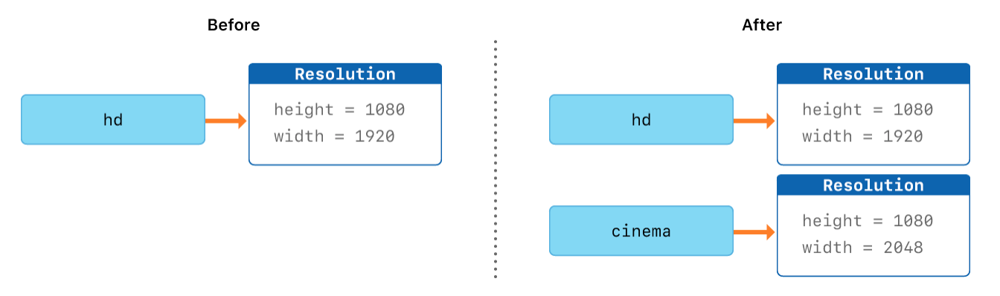
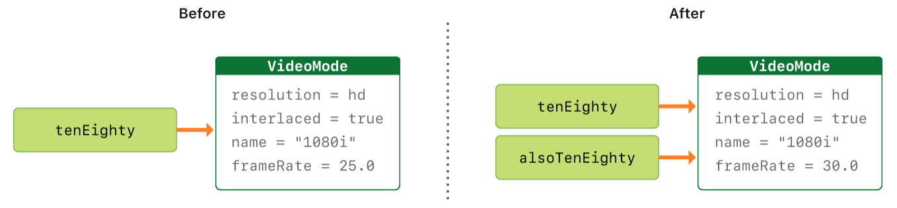

# Enum (Перечисления)

## 1. Ассоциированные параметры

- У каждого из членов перечисления могут быть ассоциированные с ним значения, то есть его характеристики. Они указываются для каждого члена точно так же, как входящие аргументы функции, то есть в круглых скобках с указанием имен и типов, разделенных двоеточием. Набор ассоциированных параметров может быть уникальным для каждого отдельного члена.

```Swift
enum DollarCountries {
    case usa
    case canada
    case australia
}
enum AdvancedCurrencyUnit {
    case rouble(сountries: [String], shortName: String)
    case euro(сountries: [String], shortName: String)
    case dollar(nation: DollarCountries, shortName: String)
}
var dollarCurrency: AdvancedCurrencyUnit = .dollar( nation: .usa, shortName: "USD" )
```

## 2. Вложенные перечисления

- Перечисления могут быть частью других перечислений, то есть могут быть опре- делены в области видимости родительских перечислений.

```Swift
enum AdvancedCurrencyUnit1 {
    enum DollarCountries {
        case usa
        case canada
        case australia
    }
    case rouble(сountries: [String], shortName: String)
    case euro(сountries: [String], shortName: String)
    case dollar(nation: DollarCountries, shortName: String)
}
let australia: AdvancedCurrencyUnit1.DollarCountries = .australia
```

## 3. Оператор switch для перечислений

- Для анализа и разбора значений перечислений можно использовать оператор switch.

```Swift
switch dollarCurrency {
    case .rouble:
        print("Рубль")
    case let .euro(countries, shortname):
        print("Евро. Страны: \(countries). Краткое наименование: \(shortname)")
    case .dollar(let nation, let shortname):
        print("Доллар \(nation). Краткое наименование: \(shortname)")
 }
```

## 4. Связанные значения членов перечисления

- Как альтернативу ассоциированным параметрам для членов перечислений им можно задать связанные значения некоторого типа данных (например, String, Character или Int). В результате вы получаете член перечисления и постоянно привязанное к нему значение.


```Swift
enum Smile: String {
    case joy = ":)"
    case laugh = ":D"
    case sorrow = ":("
    case surprise = "o_O"
}
```

- Связанные значения и ассоциированные параметры не одно и то же. Первые устанавливаются при определении перечисления, причем обязательно для всех его членов и в одинаковом типе данных. Ассоциированные параметры могут быть различны для каждого перечисления и устанавливаются лишь при инициализации члена перечисления в качестве значения.

- Если в качестве типа данных перечисления указать Int, то исходные значения создаются автоматически путем увеличения значения на единицу для каждого последующего члена

```Swift
enum Planet: Int {
      case mercury = 1, venus, earth, mars, jupiter, saturn, uranus, neptune, pluto = 999
}
```

## 5. Доступ к связанным значениям

- При создании экземпляра перечисления можно получить доступ к исходному значению члена этого экземпляра перечисления. Для этого используется свойство rawValue.

```Swift
let iAmHappy = Smile.joy
iAmHappy.rawValue // ":)"
```

## 6. Инициализатор

- При объявлении структуры в ее состав обязательно входит специальный метод- инициализатор. Более того, вам даже не требуется его объявлять, так как эта возможность заложена в Swift изначально.
-  Перечисления имеют всего один инициализатор init(rawValue:). Он позволяет передать связанное значение, соответствующее требуемому члену перечисления. Таким образом, у нас есть возможность инициализировать параметру конкретный член перечисления по связанному с ним значению.
- Данный метод не описан в теле перечисления, — он существует там всегда по умолчанию и закреплен в исходном коде языка Swift.
- Инициализатор init(rawValue:) возвращает опционал, поэтому если вы укажете несуществующее связанное значение, вернется nil.

```Swift
let myPlanet = Planet.init(rawValue: 3) // earth
var anotherPlanet = Planet.init(rawValue: 11) // nil
```

## 7. Свойства в перечислениях

- Свойство в перечислении — это хранилище, аналогичное переменной или кон- станте, объявленное в пределах перечисления, доступ к которому осуществляется через экземпляр перечисления.
- В Swift существует определенное ограничение для свойств в перечислениях: в качестве их значений не могут выступать фиксиро- ванные значения-литералы, только замыкания. Такие свойства называются вы- числяемыми. При каждом обращении к ним происходит вычисление присвоенного замыкания с возвращением получившегося значения.
- Вычисляемое свойство должно быть объявлено как переменная (var). В против- ном случае (если используете оператор let) вы получите сообщение об ошибке.
- С помощью оператора self внутри замыкания вы получаете доступ к текущему члену перечисления, при этом его использование не является обязательным.

```Swift
enum Smile1: String {
    case joy = ":)"
    case laugh = ":D"
    case sorrow = ":("
    case surprise = "o_O"
    // вычисляемое свойство
    var description: String { return self.rawValue }
}
let mySmile: Smile1 = .sorrow
mySmile.description // ":("
```

## 8. Методы в перечислениях

- Перечисления могут группировать в себе в том числе и методы.

```Swift
enum Smile2: String {
    case joy = ":)"
    case laugh = ":D"
    case sorrow = ":("
    case surprise = "o_O"
    var description: String {return self.rawValue}
    func about() {
        print("Перечисление содержит список смайликов")
    }
}
var otherSmile = Smile2.joy
otherSmile.about()
```

## 9. Оператор self

- Для организации доступа к текущему значению перечисления внутри этого перечисления используется оператор self. Данный оператор возвращает указатель на текущий конкретный член перечисления, инициализированный параметру.

```Swift
enum Smile3: String {
    case joy = ":)"
    case laugh = ":D"
    case sorrow = ":("
    case surprise = "o_O"
    var description: String { return self.rawValue }
    func about() {
        print("Перечисление содержит список смайликов")
    }
    func descriptionValue() -> Smile3 {
        return self
    }
    func descriptionRawValue() -> String {
        // использование self перед rawValue не является обязательным
        return rawValue
    }
}
var otherSmile3 = Smile3.joy
otherSmile3.descriptionValue() // joy
otherSmile3.descriptionRawValue() // ":)"
```

## 10.  Рекурсивные перечисления

- Вы можете наделить перечисление функциональностью анализа собственного значения и вычисления на его основе выражений.

```Swift
enum ArithmeticExpression {
    // указатель на конкретное значение
    case number( Int )
    // указатель на операцию сложения
    indirect case addition( ArithmeticExpression, ArithmeticExpression )
    // указатель на операцию вычитания
    indirect case subtraction( ArithmeticExpression, ArithmeticExpression )
    // метод, проводящий операцию
    func evaluate( _ expression: ArithmeticExpression? = nil ) -> Int {
        // определение типа операнда (значение или операция)
        switch expression ?? self {
            case let .number( value ):
                return value
            case let .addition( valueLeft, valueRight ):
                return evaluate( valueLeft ) + evaluate( valueRight )
            case .subtraction( let valueLeft, let valueRight ):
                return evaluate( valueLeft ) - evaluate( valueRight )
} }
}
let hardExpr = ArithmeticExpression.addition( .number(20), .subtraction( .number(10), .number(34) ) )
hardExpr.evaluate() // -4
```
  
# Struct & Class (Структуры и Классы)

## 1. Общее у Структур и Классов

- У обоих можно объявлять: свойства, методы, индексы (сабскрипты), инициализаторы
- Оба могут быть расширены

## 2. Различия у Структур и Классов

- Классы - ссылочный тип, структуры - тип значения
- У классов есть в отличии у структур: наследование, деинициализаторы, приведение типов, подсчет ссылок (ARC)
- У классов есть автоматически генерированный "поэлементный инициализатор", у классов нету

## 4. Синтаксис объявления

```Swift
struct Resolution {
    var width = 0
    var height = 0
}
class VideoMode {
    var resolution = Resolution()
    var interlaced = false
    var frameRate = 0.0
    var name: String?
}
```

## 5. Экземпляры класса и структуры

```Swift
let someResolution = Resolution()
let someVideoMode = VideoMode()
```

## 6. Доступ к свойствам

- доступ к свойствам осуществляется через точечный синтаксис

```Swift
print(someResolution.width)
print(someVideoMode.resolution.width)
```

## 7. Поэлементные инициализаторы структурных типов

```Swift
let vga = Resolution(width: 640, height: 480)
```

## 8. Структуры и перечисления - типы значения

- Тип значения - это тип, при копировании которого копируется **значение** текущего экземпляр.



## 9. Классы - ссылочный тип

- Ссылочный тип - это тип, при копировании которого копируется **ссылка** на текущий экземпляр.



## 10. Операторы тождественности

- Операторы тождественности - проверяют ссылаются ли две константы или переменные на один и тот же экземпляр класса. 
  - Идентичен (===)
  - Не идентичен ( !== )

# Property (Свойства)

## 1. Общие сведения

- **Свойства** - связывают значения с определённым классом, структурой или перечислением.
- **Свойства хранения** - хранят значения (обеспечиваются только классами или структурами)
- **Вычисляемые свойства** - вычисляют значения, а не хранят их (обеспечиваются классами, структурами или перечислениями)
- **Глобальные переменные** - переменные, которые объявляются вне любой функции, метода, замыкания или контекста типа. 
- **Локальные переменные** - переменные, которые объявляются внутри функции, метода или внутри контекста замыкания.

## 2. Свойства хранения

- **var** - переменная
- **let** - константа

```Swift
struct FixedLengthRange {
    var firstValue: Int
    let length: Int
}
var rangeOfThreeItems = FixedLengthRange(firstValue: 0, length: 3)
// диапазон чисел 0, 1, 2
rangeOfThreeItems.firstValue = 6
// сейчас диапазон чисел 6, 7, 8
```

## 3. Свойства хранения постоянных экземпляров структуры

- Если **экземпляр структуры константа**, то вы не можете изменять его свойства, даже если они объявлены как переменные:

```Swift
let rangeOfFourItems = FixedLengthRange(firstValue: 0, length: 4)
// теперь диапазон чисел выглядит как  0, 1, 2, 3
rangeOfFourItems.firstValue = 6
// это вызовет ошибку, даже несмотря на то, что firstValue переменная
```

- Такое поведение объясняется тем, что структура является типом значений. Когда экземпляр типа значений отмечен как константа, то все его свойства так же считаются константами.
- Такое поведение **не применимо к классам**, так как они являются ссылочным типом. Если вы присваиваете экземпляр ссылочного типа константе, то он все еще может менять переменные свойства.

## 4. Ленивые свойства хранения

- **Ленивое свойство хранения (lazy)** - свойство, начальное значение которого не вычисляется до первого использования. Ленивые свойства полезны, когда исходное значение свойства зависит от внешних факторов, значения которых неизвестны до окончания инициализации. Так же ленивые свойства полезны, когда начальное значение требует комплексных настроек или сложных вычислений, которые не должны быть проведены до того момента, пока они не понадобятся.
- **Всегда объявляйте свойства ленивого хранения как переменные**, потому что ее значение может быть не получено до окончания инициализации. Свойства-константы всегда должны иметь значение до того, как закончится инициализация, следовательно они не могут быть объявлены как свойства ленивого хранения.
- Если к свойству обозначенному через модификатор lazy обращаются сразу с нескольких потоков единовременно, и если оно еще не было инициализировано, то нет никакой гарантии того, что оно будет инициализировано всего один раз.

```Swift
class DataImporter {
    /*  
     DataImporter - класс для импорта данных из внешних источников
     Считаем, что классу требуется большое количество времени для инициализации
     */
    var fileName = "data.txt"
    // класс DataImporter функционал данных будет описан тут
}
 
class DataManager {
    lazy var importer = DataImporter()
    var data = [String]()
    // класс DataManager обеспечит необходимую функциональность тут
}
 
let manager = DataManager()
manager.data.append("Some data")
manager.data.append("Some more data")
// экземпляр класса DataImporter для свойства importer еще не создано

print(manager.importer.fileName)
// экземпляр DataImporter для свойства importer только что был создан
// Выведет "data.txt"
```

## 5. Вычисляемые свойства

- Вычисляемые свойства не хранят значения. Вместо этого они предоставляют геттер и опциональный сеттер для получения и установки других свойств косвенно.

```Swift
struct Rect {
    var a = 4
    var b: Int {
        get {
            return a + 2
        }
        set(newCenter) {
            a = newCenter - 2
        }
    }
}
```

## 6. Вычисляемые свойства только для чтения

- **Вычисляемые свойства только для чтения** - вычисляемое свойство имеющее геттер, но не имеющее сеттера.
- Вы должны объявлять вычисляемые свойства, включая вычисляемые свойства для чтения, как переменные свойства с ключевым словом var, потому что их значение не фиксировано. Ключевое слово let используется только для константных свойств, значение которых не может меняться, после того как было установлено как часть инициализации экземпляра.

```Swift
struct Cuboid {
    var width = 0.0, height = 0.0, depth = 0.0
    var volume: Double {
        return width * height * depth
    }
}
let fourByFiveByTwo = Cuboid(width: 4.0, height: 5.0, depth: 2.0)
print("the volume of fourByFiveByTwo is \(fourByFiveByTwo.volume)")
// Выведет "the volume of fourByFiveByTwo is 40.0"
```

## 7. Наблюдатели свойства

- Наблюдатели свойств вызываются каждый раз, как устанавливается значение свойству, даже если устанавливаемое значение не отличается от старого.
- **willSet** вызывается прямо перед сохранением значения
- **didSet** вызывается сразу после сохранения значения
- Вы можете добавить наблюдателей в следующие места:
  - Свойства хранения, которые вы определяете
  - Свойства хранения, которые вы наследуете
  - Вычисляемые свойства, которые вы наследуете
- Наблюдатели willSet и didSet суперкласса вызываются, когда свойство устанавливается в инициализаторе подкласса. Они не вызываются в то время, пока класс устанавливает свои собственные свойства, до того, пока не будет вызван инициализатор суперкласса.
- Если вы передаете свойство, имеющее наблюдателей, в функцию в качестве сквозного параметра, то наблюдатели willSet и didSet всегда вызываются. Это происходит из-за модели памяти копирования copy-in copy-out для сквозных параметров: Значение всегда записывается обратно в свойство в конце функции. 

```Swift
class StepCounter {
    var totalSteps: Int = 0 {
        willSet(newTotalSteps) {
            print("Вот-вот значение будет равно \(newTotalSteps)")
        }
        didSet {
            if totalSteps > oldValue  {
                print("Добавлено \(totalSteps - oldValue) шагов")
            }
        }
    }
}
let stepCounter = StepCounter()
stepCounter.totalSteps = 200
// Вот-вот значение будет равно 200
// Добавлено 200 шагов
stepCounter.totalSteps = 360
// Вот-вот значение будет равно 360
// Добавлено 160 шагов
```

## 8. Обертки для свойств
- Обертка свойства добавляет слой разделения между кодом, который определяет как свойство хранится и кодом, который определяет само свойство. Например, если у вас есть свойства, которые предоставляют потокобезопасную проверку или просто хранят данные в базе данных, то вы должны писать сервисный код для каждого свойства. Когда вы используете обертку, то вы пишете управляющий код один раз, а затем определяете обертку, которую можете переиспользовать для необходимых свойств.
- Для того, чтобы определить обертку, вы создаете структуру, перечисление или класс, который определяет свойство **wrappedValue**. 

```Swift
@propertyWrapper
struct TwelveOrLess {
    private var number = 0
    var wrappedValue: Int {
        get { return number }
        set { number = min(newValue, 12) }
    }
}
```

- Вы применяете обертку для свойства написав имя обертки перед свойством в виде атрибута. 

```Swift
struct SmallRectangle {
    @TwelveOrLess var height: Int
    @TwelveOrLess var width: Int
}

var rectangle = SmallRectangle()
print(rectangle.height)
// Выведет "0"

rectangle.height = 10
print(rectangle.height)
// Выведет "10"

rectangle.height = 24
print(rectangle.height)
// Выведет "12"
```

- Когда вы применяете обертку к свойству, то компилятор синтезирует код, который предоставляет хранилище для обертки, а так же код, который предоставляет доступ к свойству через эту обертку. Вы можете написать код, который использует поведение обертки свойства, не используя преимущества специального синтаксиса атрибутов.

```Swift
struct SmallRectangle {
    private var _height = TwelveOrLess()
    private var _width = TwelveOrLess()
    var height: Int {
        get { return _height.wrappedValue }
        set { _height.wrappedValue = newValue }
    }
    var width: Int {
        get { return _width.wrappedValue }
        set { _width.wrappedValue = newValue }
    }
}
```

## 9. Установка исходных значений для оберток свойств

- Для поддержки установки начального значения или другой настройки обертка свойств должна добавить инициализатор.

```Swift
@propertyWrapper
struct SmallNumber {
    private var maximum: Int
    private var number: Int

    var wrappedValue: Int {
        get { return number }
        set { number = min(newValue, maximum) }
    }

    init() {
        maximum = 12
        number = 0
    }
    init(wrappedValue: Int) {
        maximum = 12
        number = min(wrappedValue, maximum)
    }
    init(wrappedValue: Int, maximum: Int) {
        self.maximum = maximum
        number = min(wrappedValue, maximum)
    }
}
```

- Когда вы применяете обертку к свойству и не указываете начальное значение, Swift использует инициализатор init() для настройки обертки

```Swift
struct ZeroRectangle {
    @SmallNumber var height: Int
    @SmallNumber var width: Int
}

var zeroRectangle = ZeroRectangle()
print(zeroRectangle.height, zeroRectangle.width)
// Выведет "0 0"
```

- Когда вы указываете начальное значение для свойства, Swift использует инициализатор init(wrappedValue: ) для настройки обертки.

```Swift
struct UnitRectangle {
    @SmallNumber var height: Int = 1
    @SmallNumber var width: Int = 1
}

var unitRectangle = UnitRectangle()
print(unitRectangle.height, unitRectangle.width)
// Выведет "1 1"
```

- Когда вы пишете аргументы в скобках после настраиваемого атрибута, Swift использует инициализатор, который принимает эти аргументы, для настройки обертки. Например, если вы указываете начальное значение и максимальное значение, Swift использует инициализатор init(wrappedValue: maximum: )

```Swift
struct NarrowRectangle {
    @SmallNumber(wrappedValue: 2, maximum: 5) var height: Int
    @SmallNumber(wrappedValue: 3, maximum: 4) var width: Int
}

var narrowRectangle = NarrowRectangle()
print(narrowRectangle.height, narrowRectangle.width)
// Выведет "2 3"

narrowRectangle.height = 100
narrowRectangle.width = 100
print(narrowRectangle.height, narrowRectangle.width)
// Выведет "5 4"
```
- Включая аргументы в обертку свойства, вы можете настроить начальное состояние в обертке или передать другие параметры обертке при ее создании. Этот синтаксис является наиболее общим способом использования обертки свойства. Вы можете предоставить атрибуту любые необходимые аргументы, и они будут переданы инициализатору.
- Когда вы включаете аргументы обертки свойства, вы также можете указать начальное значение с помощью присваивания. Swift обрабатывает присвоение как аргумент wrappedValue и использует инициализатор, который принимает включенные вами аргументы. 

```Swift
struct MixedRectangle {
    @SmallNumber var height: Int = 1
    @SmallNumber(maximum: 9) var width: Int = 2
}

var mixedRectangle = MixedRectangle()
print(mixedRectangle.height)
// Выведет "1"

mixedRectangle.height = 20
print(mixedRectangle.height)
// Выведет "12"
```

## 10. Проецирование значения из обертки свойства

- В дополнение к обернутому значению обертка свойства может предоставлять дополнительные функциональные возможности, определяя проецируемое значение, например, обертка свойства, которая управляет доступом к базе данных, может предоставлять метод flushDatabaseConnection() для ее проецируемого значения. Имя проецируемого значения такое же, как и значение в обертке, за исключением того, что оно начинается со знака доллара (**$**). Поскольку ваш код не может определять свойства, начинающиеся с символа $, проецируемое значение никогда не влияет на свойства, которые вы определяете.
- Приведенный ниже код добавляет свойство **projectedValue** в структуру SmallNumber, чтобы отслеживать, скорректировала ли обертка свойства новое значение свойства перед сохранением этого нового значения.
- Обертка свойства может возвращать значение любого типа в качестве своего проецируемого значения. Обертка, которая должна предоставлять больше информации, может вернуть экземпляр какого-либо другого типа данных или может вернуть self, чтобы предоставить экземпляр обертки в качестве его проецируемого значения.

```Swift
@propertyWrapper
struct SmallNumber {
    private var number = 0
    var projectedValue = false
    var wrappedValue: Int {
        get { return number }
        set {
            if newValue > 12 {
                number = 12
                projectedValue = true
            } else {
                number = newValue
                projectedValue = false
            }
        }
    }
}
struct SomeStructure {
    @SmallNumber var someNumber: Int
}
var someStructure = SomeStructure()

someStructure.someNumber = 4
print(someStructure.$someNumber)
// Выведет "false"

someStructure.someNumber = 55
print(someStructure.$someNumber)
// Выведет "true"
```

- Когда вы получаете доступ к проецируемому значению из кода, который является частью типа, например, для метода получения свойства или метода экземпляра, вы можете опустить self. перед именем свойства, как при доступе к другим свойствам.
- Поскольку синтаксис обертки свойства - это просто синтаксический сахар для свойства с геттером и сеттером, доступ к высоте и ширине ведет себя так же, как доступ к любому другому свойству.

```Swift
enum Size {
    case small, large
}

struct SizedRectangle {
    @SmallNumber var height: Int
    @SmallNumber var width: Int

    mutating func resize(to size: Size) -> Bool {
        switch size {
        case .small:
            height = 10
            width = 20
        case .large:
            height = 100
            width = 100
        }
        return $height || $width
    }
}
```

## 11. Свойства типа

- **Свойства экземпляров** - свойства, которые принадлежат экземпляру конкретного типа. Каждый раз, когда вы создаете экземпляр этого типа, он имеет свои собственные свойства экземпляра, отдельные от другого экземпляра.
- **Свойства типа** - свойства, которые принадлежат самому типу, а не экземплярам этого типа. Будет всего одна копия этих свойств, и не важно сколько экземпляров вы создадите.
- Свойства типа полезны при объявлении значений, которые являются универсальными для всех экземпляров конкретного типа, которое могут использовать все экземпляры данного типа
- В отличии от свойств хранения экземпляра, вы должны всегда давать свойствам типов значение по умолчанию. Это потому, что тип сам по себе не имеет инициализатора, который мог бы присвоить значение хранимому свойству типа.
- Хранимые свойства типа отложено инициализируются при первом обращении к ним. Они гарантировано инициализируются только один раз, даже если они доступны сразу для нескольких потоков. Эти свойства не нуждаются в маркировке lazy.
- Чтобы объявить свойства типа, используйте ключевое слово **static**. 
- Для вычисляемых свойств самого класса, вы должны использовать ключевое слово **class**, чтобы разрешать подклассам переопределение инструкций суперкласса.
- Запрос и присваивание значения происходит в свойстве типа, а не в экземпляре того типа.
```Swift
struct SomeStructure {
    static var storedTypeProperty = "Some value."
    static var computedTypeProperty: Int {
        return 1
    }
}
enum SomeEnumeration {
    static var storedTypeProperty = "Some value."
    static var computedTypeProperty: Int {
        return 6
    }
}
class SomeClass {
    static var storedTypeProperty = "Some value."
    static var computedTypeProperty: Int {
        return 27
    }
    class var overridableComputedTypeProperty: Int {
        return 107
    }
}
print(SomeStructure.storedTypeProperty)
// Выведет "Some value."
SomeStructure.storedTypeProperty = "Another value."
print(SomeStructure.storedTypeProperty)
// Выведет "Another value."
print(SomeEnumeration.computedTypeProperty)
// Выведет "6"
print(SomeClass.computedTypeProperty)
// Выведет "27"
```
